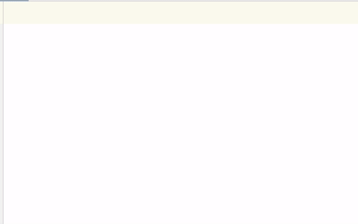

# TXTC-language

Плагин, определяющий язык TXTC -- plain text + для введённого появляется список английских слов, начинающихся с этой подстроки, которые отсортированы по частоте использования.
Справа от каждого предлагаемого слова указана частота встречаемости.

Частотный словарь хранится в виде json файла и парсится с помощью [Klaxon](https://github.com/cbeust/klaxon)

Установка:
- 
Скопируйте этот репозиторий к себе на компьютер:
*gh repo clone rinatisk/TXTC-language*

В корне репозитория выполните:
*./gradlew runIde*

Откроется Intellij IDEA с установленным плагином

---
Plugin based on the [IntelliJ Platform Plugin Template][template].

[template]: https://github.com/JetBrains/intellij-platform-plugin-template
